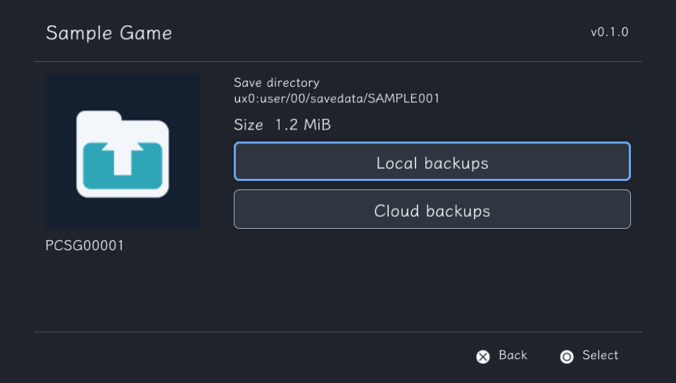
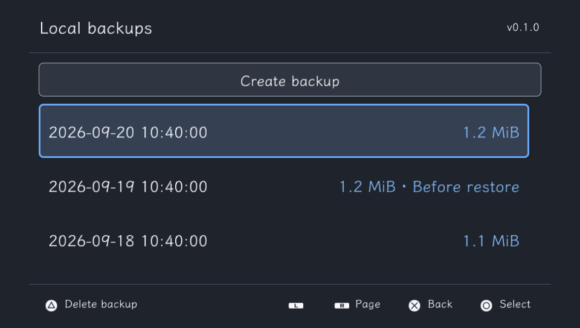
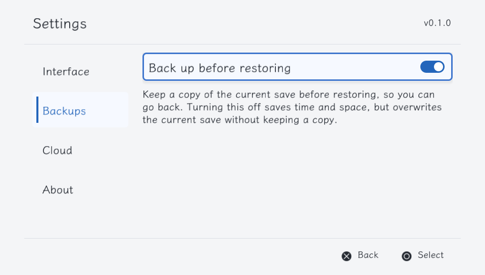
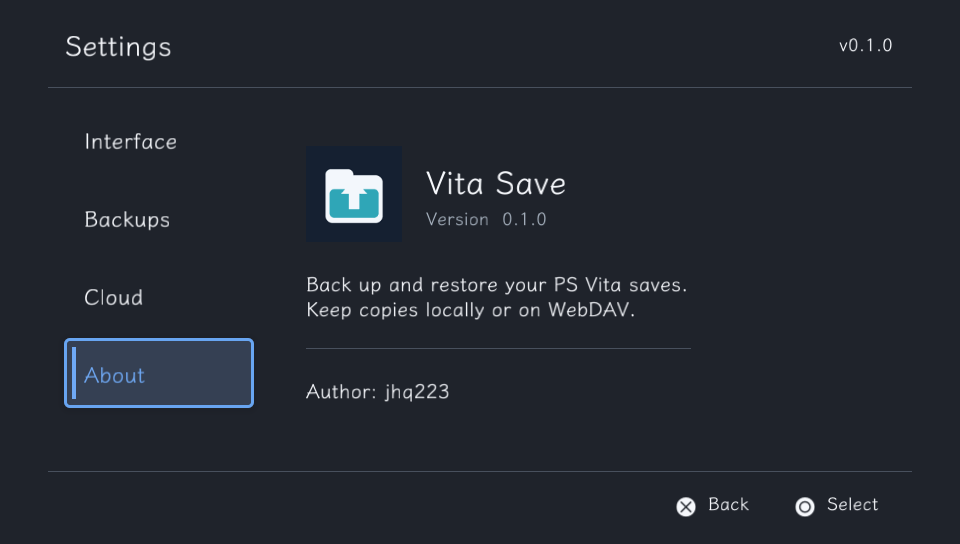

# Vita Save

[简体中文](README.zh-CN.md) · [Download](https://github.com/jhq223/vita-save/releases/latest)

A PS Vita save manager with local backups and WebDAV cloud storage. Written in Rust, with a [Nivora](https://github.com/jhq223/Nivora) interface.

- Create, restore and delete independent local backups.
- Upload backups to WebDAV and download them to another device.
- Verify backup files with SHA-256 before restoring or importing them.
- Keep an optional backup before restoring, with recovery for interrupted operations.
- Chinese and English interfaces, light and dark themes, controller and touch input.

## Screenshots

Desktop-rendered previews of the application UI at 960 × 544, using sample data.

| Game details | Local backups |
| --- | --- |
|  |  |
| Backup settings | About |
|  |  |

## Install

1. Download `vita-save.vpk` from [Releases](https://github.com/jhq223/vita-save/releases/latest).
2. Transfer it to a PS Vita with homebrew support and install it with VitaShell.
3. Close the game before backing up or restoring its save.

The VPK includes the save-mounting modules and graphics runtime. No separate ioPlus installation is needed.

## Use

Select a game, then choose **Local backups** or **Cloud backups**.

In **Local backups**, choose **Create backup**. Open a backup to restore, upload or delete it. Deleting a local backup does not delete the game's current save or its cloud copy.

**Settings → Backups → Back up before restoring** is enabled by default. It keeps the current save before overwriting it. Turn it off to save time and space; the current save will then be overwritten without keeping a copy.

If a restore is interrupted, open **Local backups**. **Recover previous save** rolls back using the automatic backup; when no automatic backup was made, **Retry interrupted restore** writes the originally selected backup again. Backups needed by an unfinished restore cannot be deleted.

| Control | Action |
| --- | --- |
| D-pad / touch | Navigate |
| ○ / × | Confirm / back |
| △ | Delete the selected local backup |
| START | Refresh the game list |
| SELECT | Open settings |
| L / R | Page through lists |

## WebDAV

Open **Settings → Cloud**, enter the URL, username and password, then select **Test connection**. The URL must point to an existing WebDAV directory. The test checks directory access, file upload, download and cleanup in a dialog.

Uploads use an existing local backup. Downloads add a local backup; restore it separately to change the game save. There is no automatic synchronization.

Remote files are stored below the configured directory:

```text
vita-save/<Title ID>/<Save ID>/<backup ID>.vsave
```

The server must support Basic authentication and PROPFIND, MKCOL, PUT, GET and DELETE. Uploads do not require MOVE. HTTPS certificates are verified using bundled CA roots; iTLS-Enso is not required. Some servers keep partial files after an interrupted upload; incomplete downloads are rejected.

Credentials are stored as plain text in `ux0:data/vita-save/config.toml`. They are not included in save backups.

## Local data

```text
ux0:data/vita-save/
├── config.toml
├── snapshots/
│   └── <backup ID>/
│       ├── manifest.bin
│       └── files/
├── recovery/
├── staging/
└── trash/
```

Each snapshot contains metadata and a complete, uncompressed copy of the save files. Copy the entire backup directory, including `manifest.bin` and `files/`, to keep it on a computer. `staging/` and `trash/` hold temporary files; `recovery/` records unfinished restores. Backup dates use the Vita's local time.

The app scans `ux0:user/00/savedata` and `grw0:savedata`. Legacy vita-savemgr backup import and conversion between game regions are not supported.

## Build

Use Linux or WSL with VitaSDK, cargo-vita and the Rust toolchain specified in `rust-toolchain.toml`. Set `VITASDK` if the SDK is not installed at `/usr/local/vitasdk`.

```sh
git clone https://github.com/jhq223/vita-save.git
cd vita-save
bash scripts/build-vita.sh
```

Output: `target/armv7-sony-vita-newlibeabihf/release/vita-save.vpk`.

Host checks:

```sh
cargo fmt --all -- --check
cargo test --locked
cargo clippy --all-targets --locked -- -D warnings
```

Host tests use plaintext save fixtures. They do not replace device testing of mounting, interrupted writes or game loading. See [implementation notes](docs/design.md) and [graphics runtime provenance](docs/pvr-runtime.md) for development details.

## Credits and license

Vita Save is licensed under [GPL-3.0-or-later](LICENSE). The mount bridge follows vita-save-keeper and VitaShell; see [upstream attribution](native/UPSTREAM.md).

The interface uses [Nivora](https://github.com/jhq223/Nivora), [QiushuiShotai](runtime/font/QiushuiShotai-LICENSE.txt) and [PromptFont](runtime/font/PromptFont-LICENSE.txt). Graphics modules come from [pvr-psp2-sys](https://github.com/jhq223/pvr-psp2-sys). Bundled components retain their respective licenses.
