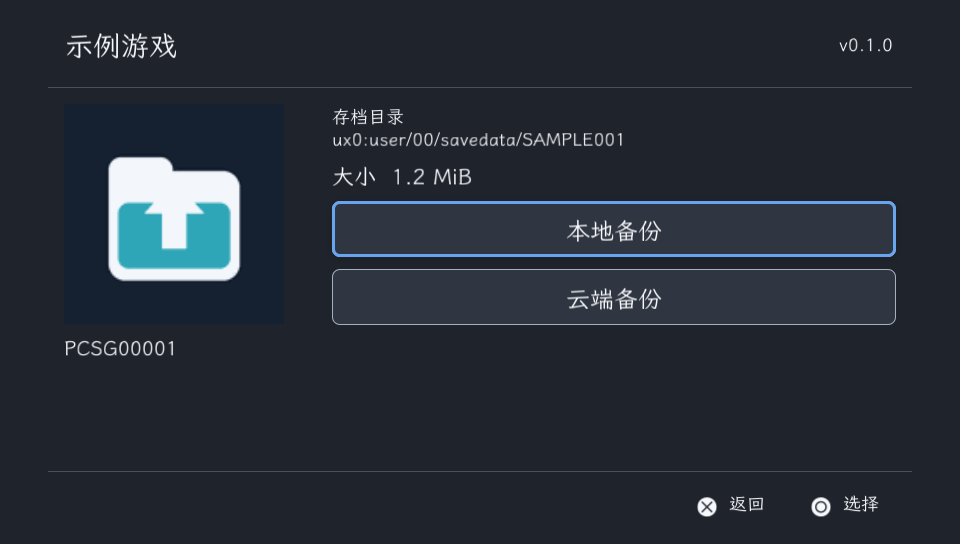
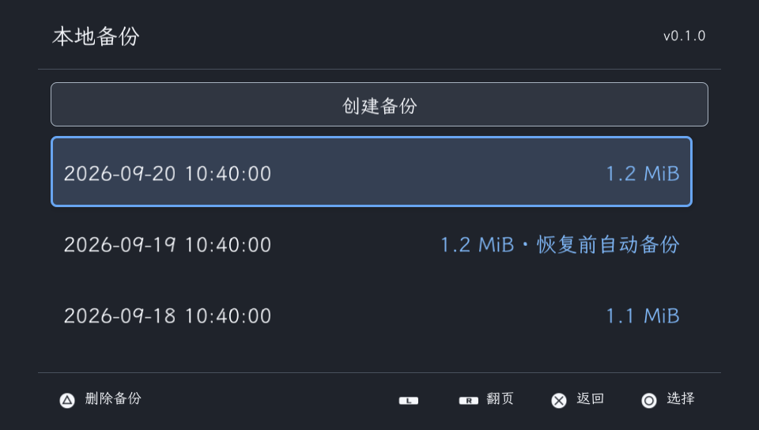
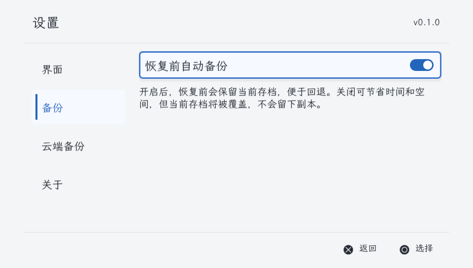
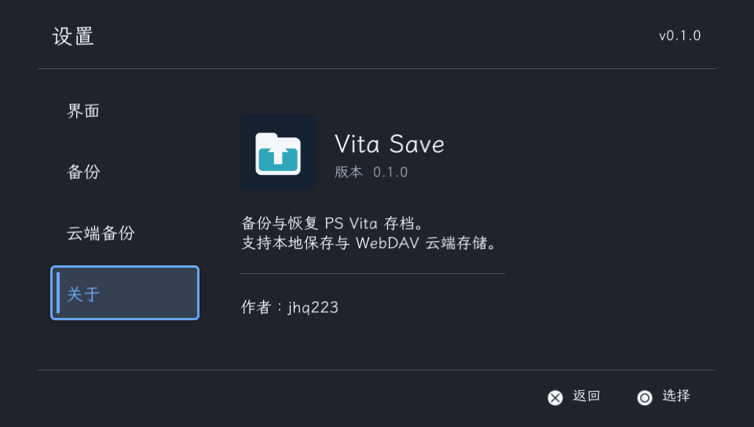

# Vita Save

[English](README.md) · [下载](https://github.com/jhq223/vita-save/releases/latest)

PS Vita 存档管理器，支持本地备份与 WebDAV 云端存储。使用 Rust 编写，界面基于 [Nivora](https://github.com/jhq223/Nivora)。

- 创建、恢复和删除独立的本地备份。
- 将备份上传到 WebDAV，或下载到另一台设备。
- 恢复和导入前使用 SHA-256 校验备份文件。
- 可选的恢复前自动备份，以及恢复中断后的处理。
- 中文与英文界面、深浅主题、按键和触控操作。

## 示例截图

| 游戏详情 | 本地备份 |
| --- | --- |
|  |  |
| 备份设置 | 关于 |
|  |  |

## 安装

1. 从 [Releases](https://github.com/jhq223/vita-save/releases/latest) 下载 `vita-save.vpk`。
2. 传输到支持自制软件的 PS Vita，使用 VitaShell 安装。
3. 备份或恢复存档前，先关闭游戏。

## 使用

选择游戏，在详情页进入「本地备份」或「云端备份」。

在「本地备份」选择「创建备份」。打开一条备份记录后，可以恢复、上传或删除。删除本地备份不会影响游戏当前存档及其云端副本。

「设置 → 备份 → 恢复前自动备份」默认开启，覆盖前会保留当前存档。关闭可节省时间和空间，但当前存档会被直接覆盖，不留下副本。

如果恢复中断，进入「本地备份」处理：「恢复中断前的存档」使用自动备份回退；当次没有生成自动备份时，「重试上次恢复」会重新写入原先选中的备份。未完成的恢复所需的备份不能删除。

| 操作 | 功能 |
| --- | --- |
| 方向键 / 触控 | 导航 |
| ○ / × | 确认 / 返回 |
| △ | 删除选中的本地备份 |
| START | 刷新游戏列表 |
| SELECT | 打开设置 |
| L / R | 列表翻页 |

## WebDAV

进入「设置 → 云端备份」，填写地址、用户名和密码，然后选择「测试连接」。地址须指向已经存在的 WebDAV 目录。测试会在弹窗中检查目录访问、文件上传、下载和清理。

文件保存在所配置目录的以下位置：

```text
vita-save/<Title ID>/<Save ID>/<备份 ID>.vsave
```

服务器须支持 Basic 认证以及 PROPFIND、MKCOL、PUT、GET、DELETE。HTTPS 使用内置 CA 校验证书，无需 iTLS-Enso。部分服务器会在上传中断后保留不完整文件；应用会拒绝导入不完整的下载。

凭据以明文保存在 `ux0:data/vita-save/config.toml`。

## 本地数据

```text
ux0:data/vita-save/
├── config.toml
├── snapshots/
│   └── <备份 ID>/
│       ├── manifest.bin
│       └── files/
├── recovery/
├── staging/
└── trash/
```

每份备份包含元数据和完整、未压缩的存档文件。复制到电脑留存时，请一起复制整个备份目录中的 `manifest.bin` 与 `files/`。`staging/` 和 `trash/` 用于临时文件，`recovery/` 记录未完成的恢复。备份日期按 Vita 本地时间显示。

应用扫描 `ux0:user/00/savedata` 与 `grw0:savedata`。

## 构建

在 Linux 或 WSL 中准备 VitaSDK、cargo-vita，以及 `rust-toolchain.toml` 指定的 Rust 工具链。SDK 不在 `/usr/local/vitasdk` 时，请设置 `VITASDK`。

```sh
git clone https://github.com/jhq223/vita-save.git
cd vita-save
bash scripts/build-vita.sh
```

产物：`target/armv7-sony-vita-newlibeabihf/release/vita-save.vpk`。

主机检查：

```sh
cargo fmt --all -- --check
cargo test --locked
cargo clippy --all-targets --locked -- -D warnings
```

开发细节见[实现说明](docs/design.md)与[图形运行库来源](docs/pvr-runtime.md)。

## 致谢与许可

Vita Save 使用 [GPL-3.0-or-later](LICENSE)。挂载模块参考 vita-save-keeper 和 VitaShell，详见[上游来源](native/UPSTREAM.md)。

界面使用 [Nivora](https://github.com/jhq223/Nivora)、[秋水书体](runtime/font/QiushuiShotai-LICENSE.txt)和 [PromptFont](runtime/font/PromptFont-LICENSE.txt)。图形模块来自 [pvr-psp2-sys](https://github.com/jhq223/pvr-psp2-sys)。随附组件保留各自的许可。
